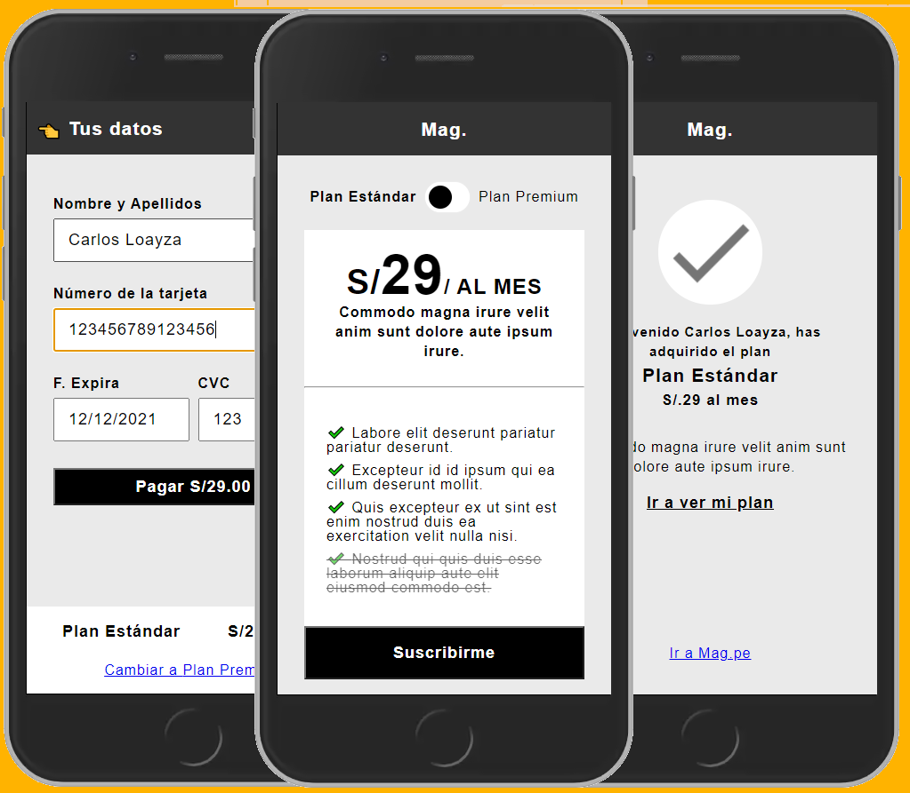
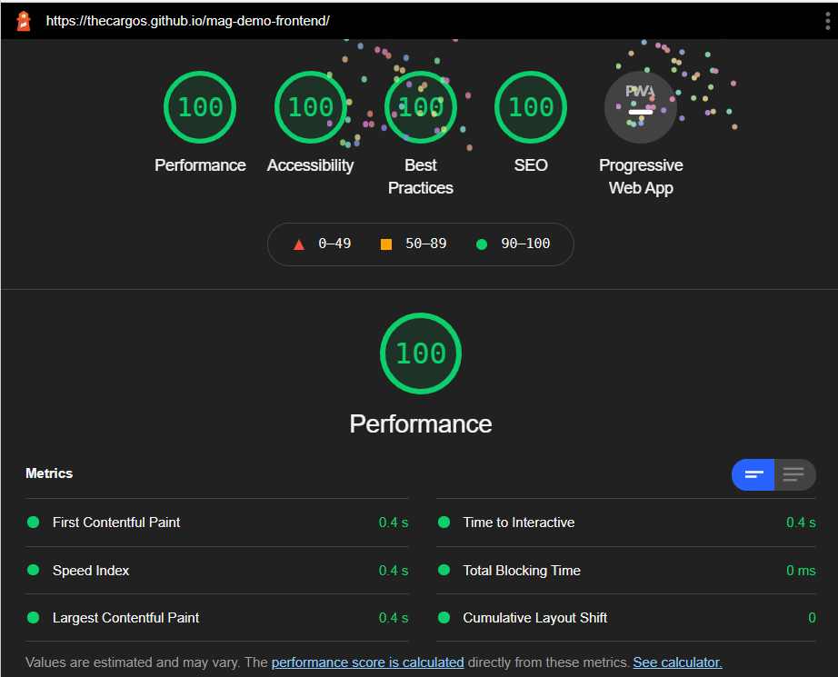
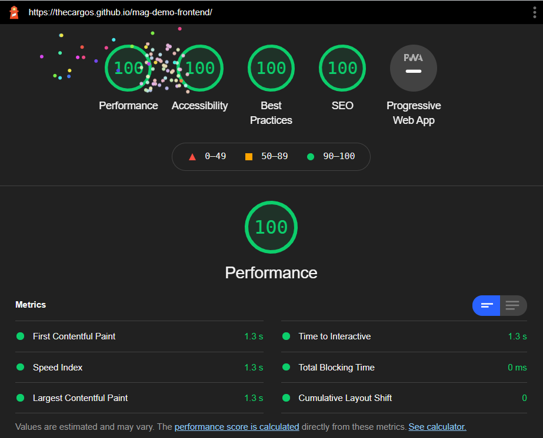

# DESAFIO MAG DEMO APP (Vanilla REACT APP)

El reto consiste en implementar en código los diseños dados [ver mockups](https://xd.adobe.com/view/95b2cf77-ac47-4c1d-5430-43576b88590e-e383/)

### Tecnologías y/o librerías implementadas
* Para este desafio se hizo unicamente de las herramientas dadas por `create react-app`, se evitaron librerías como `react-router-dom`, `redux` (aunque `useContext` pudo ser una buena opción). Tampoco se utilizó algún framework o librería de CSS como `bootstrap` o `semantic-ui`. ¿Con qué fin? subir un poco la dificultad al reto y demostrar conocimientos en lenguajes vanilla.
* Se hizo uso exclusivo de Typescript (tsx) y SASS (scss). Typescript nos permitirá crear un código limpio de bugs (por datos ingresados inesperados gracias a su tipado estático) y SASS nos ayuda a organizar mejor nuestras clases con el patrón BEM.

### Nota:
* En un entorno real, se hubiese optado por utilizar `useContext` y `useReducer` para manejar el estado desde un `higher-order component` hecho para eso (`provider`) 
* En un entorno real se hubiese optado por utilizar `semantic-ui-react` para solo reutilizar componentes de la librería y obtener los diseños y comportamientos pre-definidos, además que sus estilos generales son muy semejantes a los diseños dados por el mock-up.
* El proyecto tomó dos madrugadas en realizarse debido al tiempo dado (3 días) y a la abstención de uso de alguna librería (decision personal para agregar dificultad al reto)
### Revise el resultado final de este proyecto [ver live preview](https://thecargos.github.io/mag-demo-frontend/).

### Metrícas
Tanto las métricas en movil y escritorio dan un resultado de 100% en overall de Rendimiento, Accesibilidad, Mejores Prácticas y SEO.

#### Metrícas Escritorio

#### Metrícas Movil

# Eso fue todo, muchas gracias por llegar hasta aca! 🎉

